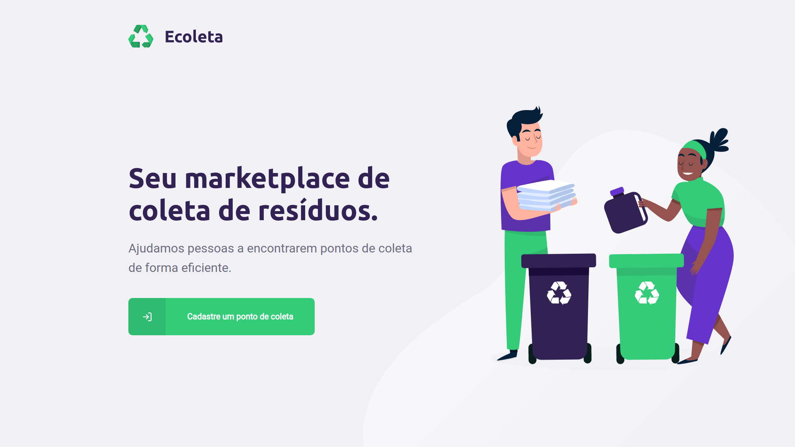
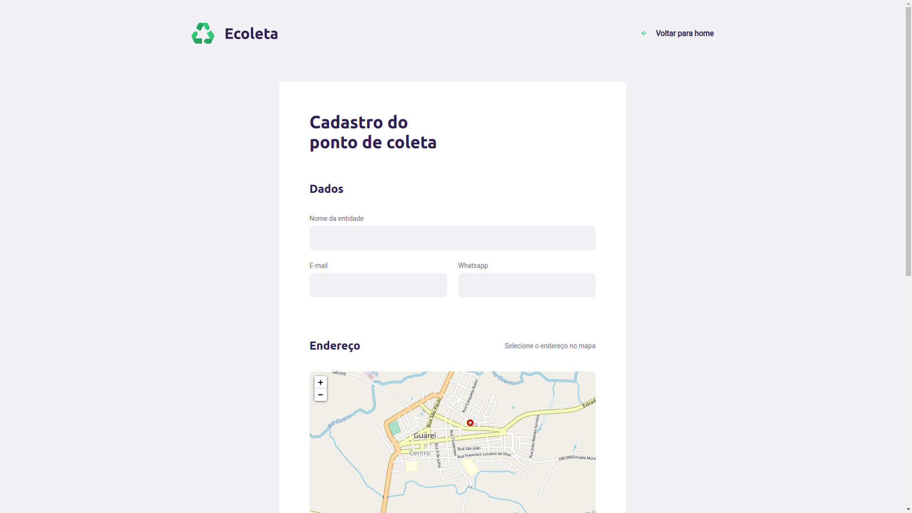
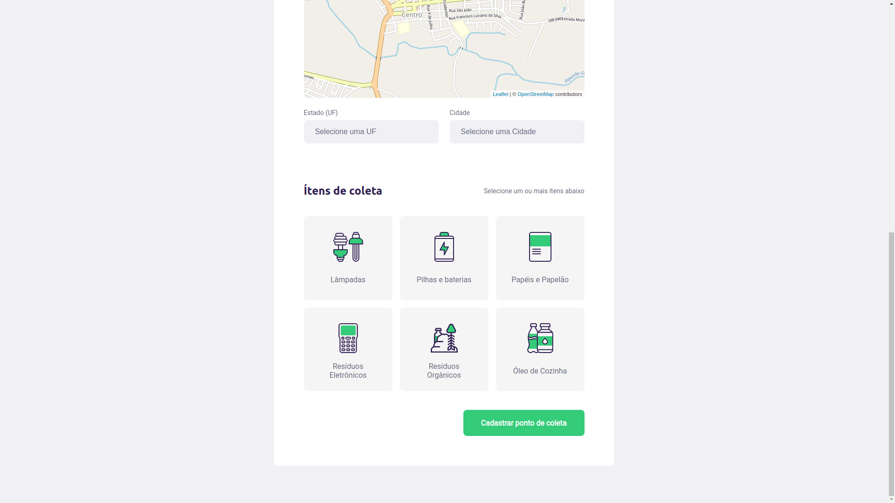

# 🚀 Rocketseat Next Level Week #1 - App Booster (Front-end)

  

Front-end do App Booster

### 👨‍💻 Uso

- Executar `yarn` para instalar as dependências;
- Executar `yarn start` para iniciar o servidor de desenvolvimento na porta 3000;

### 📚 Bibliotecas utilizadas

- styled-components
- react-icons
- react-router-dom
- leaflet
- react-leaflet
- axios
